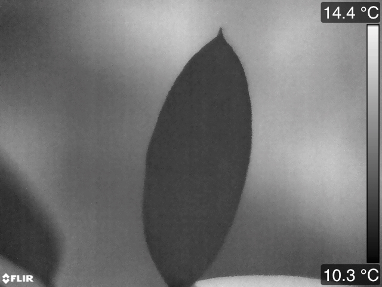
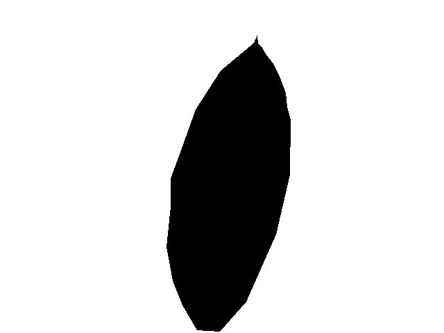
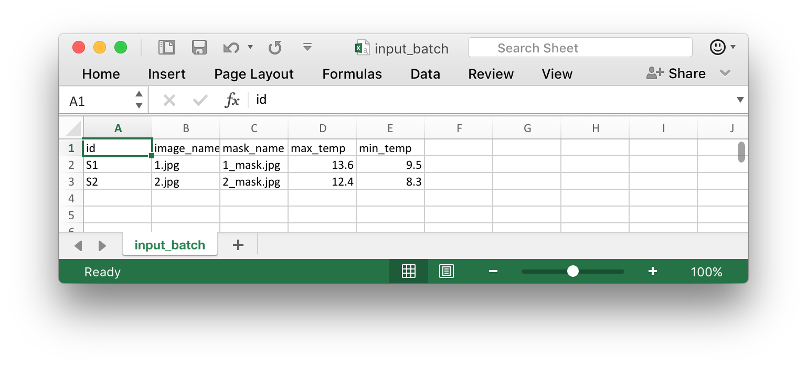

# LeafEye
## Leaf thermal image analysis assistant
Allows for filtering of subject data at high resolutions from thermal image datasets. Useful for when you want to acquire thermal distribution and not just point measurements.

## Software requirements

Python 3 (to run this)

Tested on Mac (10.10 and higher) and Linux (Ubuntu)

Recommended but not required:

- ImageJ for making image masks
- R/RStudio for further analysis

## Usage

### Setting up files

- Export each photo from FLIR Tools in grayscale, and remove extra marks (e.g. point measurements).

- Create mask image in ImageJ
 - Select the area you want with the Polygon tool
 - Fill 
 - Clear Outside
 - Save As ... > Jpeg
 
- Repeat for each image in dataset to be processed. (The pipeline and further statistics will likely take some time to process, so you might want to make a minimal working dataset to test your full analysis pipeline on)
- Encode sample name, image filename, min/max temperature, and mask filename in a table (see template)

"topleft_x" and the other three columns following denote initial cropping; if your subjects are strictly within a subset of the image, you might want to use this to speed up the image processing.
- Run the batch 