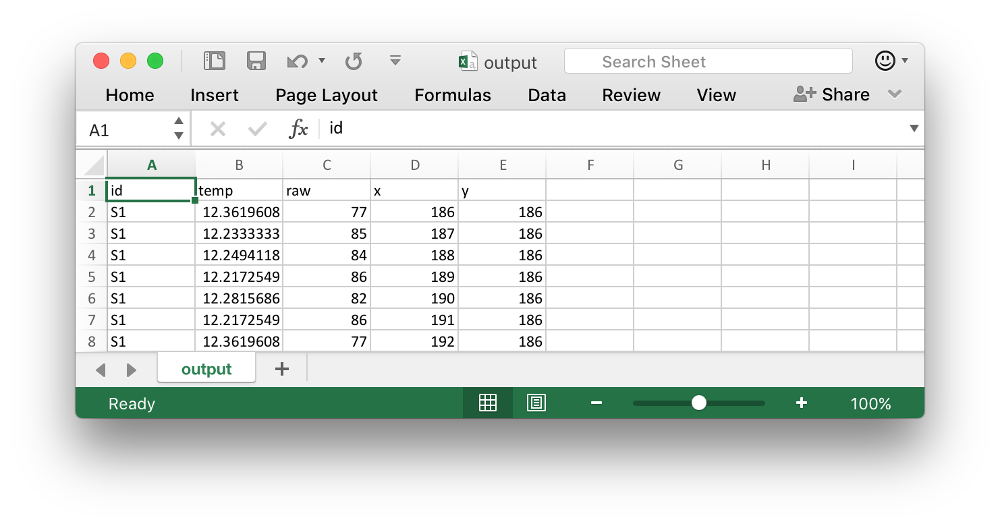

# LeafEye
## Leaf thermal image analysis assistant
Allows for filtering of subject data at high resolutions from thermal image datasets. Useful for when you want to acquire thermal distribution and not just point measurements.

## Software requirements

Python 3 (to run this)

I recommend using [Anaconda](https://conda.io/docs/user-guide/install/macos.html) to create a Python 3 environment.

Tested on Mac (10.10 and higher) and Linux (Ubuntu)

Recommended but not required:

- [ImageJ](https://imagej.nih.gov/ij/download.html) for making image masks

## Usage

### Setting up files

- Export each photo from FLIR Tools in grayscale, and remove extra marks (e.g. point measurements).

- Create mask image in ImageJ
 - Select the area you want with the Polygon tool
 - Fill 
 - Clear Outside
 - Save As ... > Jpeg
 
- Repeat for each image in dataset to be processed. (The pipeline and further statistics will likely take some time to process, so you might want to make a minimal working dataset to test your full analysis pipeline on)
- Encode sample name, image filename, min/max temperature, and mask filename in a table (see template)

- Ensure that all the images and `input_batch.csv` are in the same folder.

### Processing images
- Run batch.py on the Terminal with `python batch.py <folder path>`. On Mac, you can insert the folder path by dragging the folder on to the Terminal window.
- You should get some messages like this:

```
Initializing ... 
Starting image 1............done!
Starting image 2............done!
Saving csv ...
Completed!
```

- Look in the folder for an `output.csv`. This file can now be further processed by your statistical package.

